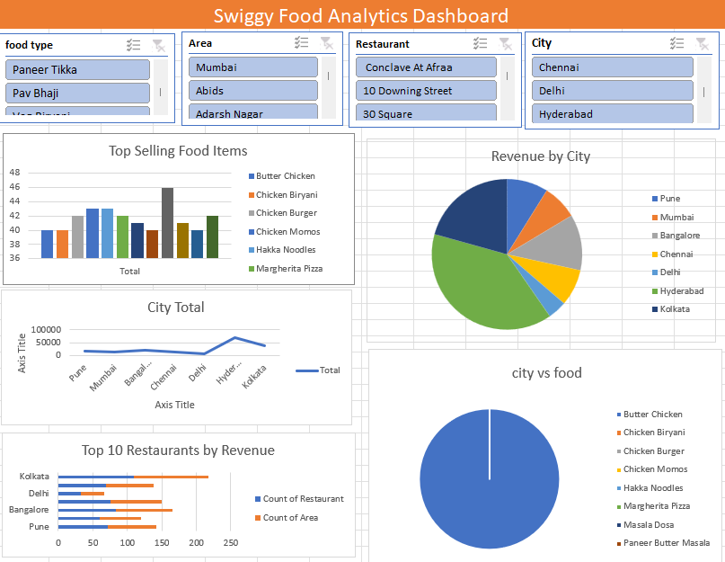

# 🍔 Swiggy Food Analytics Dashboard (Microsoft Excel)

## 📌 Project Overview

The **Swiggy Food Analytics Dashboard** is an interactive Microsoft Excel project designed to analyze food delivery data and generate meaningful business insights. The dashboard enables users to explore sales performance, restaurant performance, city-wise revenue, and food preferences using interactive charts, Pivot Tables, and slicers.

This project demonstrates data cleaning, data analysis, dashboard development, and business intelligence skills using Microsoft Excel.

# 🎯 Project Objective

The main objective of this project is to analyze Swiggy food delivery data and convert raw data into an interactive dashboard that helps stakeholders make data-driven business decisions.

# 📊 Dashboard Preview

# 📂 Dataset Information

The dataset contains food delivery information, including:

- Restaurant Name
- Food Type
- City
- Area
- Order Amount
- Revenue
- Customer Rating
- Delivery Time

# 🛠 Tools & Features Used

- Microsoft Excel
- Pivot Tables
- Pivot Charts
- Slicers
- Data Cleaning
- Sorting & Filtering
- Conditional Formatting
- Dashboard Design
- Data Visualization

# 📈 Dashboard Features

### Interactive Filters

- Food Type
- Area
- Restaurant
- City

These slicers allow users to interactively filter dashboard data.

---

### Dashboard Visualizations

- Top Selling Food Items
- Revenue by City
- City-wise Sales Analysis
- Top Restaurants by Revenue
- Food Category Distribution

# 📊 Key Performance Indicators (KPIs)

- Total Revenue
- Total Restaurants
- Total Cities
- Total Food Categories
- Average Revenue
- Most Popular Food Item

# 📌 Business Questions Solved

- Which city generates the highest revenue?
- Which restaurants perform best?
- Which food items are most popular?
- Which city has the highest number of orders?
- Which food category contributes the most to sales?
- How does restaurant performance vary across cities?

# 📈 Key Insights

- Hyderabad generated the highest revenue among all cities.
- Butter Chicken and Paneer Tikka are among the best-selling food items.
- Revenue distribution varies significantly between cities.
- A small number of restaurants contribute a large share of total revenue.
- Interactive slicers allow quick comparison across food types, restaurants, areas, and cities.

# 💡 Business Recommendations

- Increase marketing efforts in high-performing cities.
- Promote best-selling food items through targeted offers.
- Improve the visibility of lower-performing restaurants.
- Expand partnerships in cities with strong demand.
- Monitor city-wise performance regularly to support strategic decisions.

# 🚀 Skills Demonstrated

- Data Cleaning
- Data Analysis
- Microsoft Excel
- Dashboard Design
- Pivot Tables
- Pivot Charts
- Business Intelligence
- KPI Reporting
- Data Visualization
- Analytical Thinking

# 📚 Learning Outcomes

Through this project, I learned how to:

- Clean and prepare raw datasets.
- Create Pivot Tables and Pivot Charts.
- Build interactive Excel dashboards.
- Design user-friendly reports.
- Generate business insights from data.
- Present analytical findings effectively.

# 📌 Future Improvements

- Add monthly sales trend analysis.
- Include customer satisfaction metrics.
- Add delivery time analysis.
- Create dynamic KPI cards.
- Improve dashboard design with advanced formatting.

# 📊 Dashboard Preview

## Complete Dashboard

# 👨‍💻 Author

Santoshi Pandalwad

Aspiring Data Analyst

### Skills

- SQL
- Microsoft Excel
- Power BI
- Python
- Pandas
- NumPy
- Data Visualization
- Statistics

# ⭐ If you found this project useful, please consider giving it a Star!
